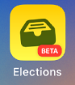
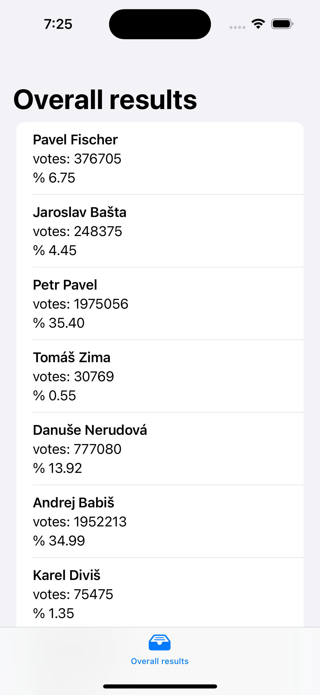

<p float="left">
    
</p>

# Elections/Volby
**Elections** is a simple app that displays up-to-date live data about the presidential election in the Czech Republic.

> **Note** Below you can see the last available screenshot (wip).

<p fff float="left">
    
</p>


## Data[^1]

The source of the data is the Czech Statistical Office ([site](https://www.czso.cz/csu/czso/home)).

English:
[Election of the President of the Czech Republic held on 13–14 January 2023](https://www.volby.cz/pls/prez2023/pe?xjazyk=EN)

Czech: 
[Volba prezidenta republiky konaná ve dnech 13.01. – 14.01.2023](https://www.volby.cz/pls/prez2023/pe?xjazyk=CZ)

[Open data](https://www.volby.cz/opendata/prez2023/prez2023_opendata.htm) formats and additional information (Czech only).

For this app, the following endpoint is used: https://www.volby.cz/pls/prez2023/vysledky. It provides data - total results for the elections in form of a simple XML. Translation of XML elements and attributes into English is available in the source code.

**1st round:**

```xml

<?xml version="1.0" encoding="utf-8"?>
<VYSLEDKY xmlns="http://www.volby.cz/prezident/" xmlns:xsi="http://www.w3.org/2001/XMLSchema-instance"
          xsi:schemaLocation="http://www.volby.cz/prezident/ pe_vysledky.xsd"
          DATUM_CAS_GENEROVANI="2023-01-15T17:34:28">
<CR>
<KANDIDAT PORADOVE_CISLO="1" JMENO="Pavel" PRIJMENI="Fischer" TITULPRED="" TITULZA="" HLASY_1KOLO="376705" HLASY_PROC_1KOLO="6.75" ZVOLEN_1KOLO="NEZVOLEN"/>
<KANDIDAT PORADOVE_CISLO="2" JMENO="Jaroslav" PRIJMENI="Bašta" TITULPRED="" TITULZA="" HLASY_1KOLO="248375" HLASY_PROC_1KOLO="4.45" ZVOLEN_1KOLO="NEZVOLEN"/>
<KANDIDAT PORADOVE_CISLO="4" JMENO="Petr" PRIJMENI="Pavel" TITULPRED="Ing." TITULZA="M.A." HLASY_1KOLO="1975056" HLASY_PROC_1KOLO="35.40" ZVOLEN_1KOLO="2.KOLO"/>
<KANDIDAT PORADOVE_CISLO="5" JMENO="Tomáš" PRIJMENI="Zima" TITULPRED="prof. MUDr." TITULZA="DrSc." HLASY_1KOLO="30769" HLASY_PROC_1KOLO="0.55" ZVOLEN_1KOLO="NEZVOLEN"/>
<KANDIDAT PORADOVE_CISLO="6" JMENO="Danuše" PRIJMENI="Nerudová" TITULPRED="prof. Ing." TITULZA="Ph.D." HLASY_1KOLO="777080" HLASY_PROC_1KOLO="13.92" ZVOLEN_1KOLO="NEZVOLEN"/>
<KANDIDAT PORADOVE_CISLO="7" JMENO="Andrej" PRIJMENI="Babiš" TITULPRED="Ing." TITULZA="" HLASY_1KOLO="1952213" HLASY_PROC_1KOLO="34.99" ZVOLEN_1KOLO="2.KOLO"/>
<KANDIDAT PORADOVE_CISLO="8" JMENO="Karel" PRIJMENI="Diviš" TITULPRED="PhDr." TITULZA="" HLASY_1KOLO="75475" HLASY_PROC_1KOLO="1.35" ZVOLEN_1KOLO="NEZVOLEN"/>
<KANDIDAT PORADOVE_CISLO="9" JMENO="Marek" PRIJMENI="Hilšer" TITULPRED="MUDr. Bc." TITULZA="Ph.D." HLASY_1KOLO="142912" HLASY_PROC_1KOLO="2.56" ZVOLEN_1KOLO="NEZVOLEN"/>
<UCAST KOLO="1" OKRSKY_CELKEM="14857" OKRSKY_ZPRAC="14857" OKRSKY_ZPRAC_PROC="100.00" ZAPSANI_VOLICI="8245962" VYDANE_OBALKY="5626824" UCAST_PROC="68.24" ODEVZDANE_OBALKY="5622812" PLATNE_HLASY="5578585" PLATNE_HLASY_PROC="99.21"/>
</CR>
</VYSLEDKY>

```

**Remark:** The XML format for the 2nd round will be slghtly changes (some of the attributes will reference the 2 round (2KOLO) instead of  1st round (1KOLO).


> **Note**
> The endpoint is updated - during elections only - every 30 sec.

> **Warning**
> All endpoints are available only withing Czech Republic (/with CZ based IP address).


[^1]: Disclaimer: Czech Statistical Office provides data only, it is in no way connected to this application. CZ: Upozornění: Český statistický úřad poskytuje pouze data, s touto aplikací nijak nesouvisí.
